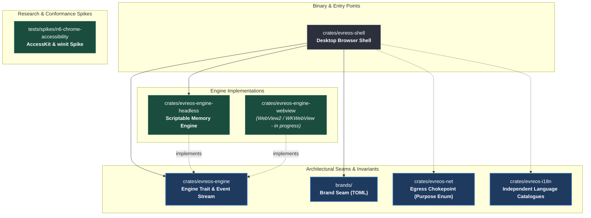

# Evreos

<p align="center">
  <strong>A featherweight, privacy-first desktop web browser built with constitutional performance discipline, doubling as the native shell for the Apivo super-app.</strong>
</p>

<p align="center">
  
  
  
  
  
  
</p>

---

## Table of Contents

- [Vision and Philosophy](#vision-and-philosophy)
- [The 10 Constitutional Principles](#the-10-constitutional-principles)
- [Current State of `main`](#current-state-of-main)
- [Architecture & Crate Graph](#architecture--crate-graph)
- [Performance Budgets & Quality Gates](#performance-budgets--quality-gates)
- [Repository Layout](#repository-layout)
- [Getting Started & Development](#getting-started--development)
- [Verification & Repository Checks](#verification--repository-checks)
- [Commit Hygiene & Authorship Policy](#commit-hygiene--authorship-policy)
- [Roadmap & Milestones](#roadmap--milestones)

---

## Vision and Philosophy

Evreos is designed to be the antithesis of modern browser bloat.

Mainstream desktop browsers consume gigabytes of memory, ship runtimes spanning hundreds of megabytes, bundle tracking networks, and inject commercial intermediaries into web interactions. Evreos rejects this model:

1. **Native System Engine, Zero Bundled Chromium**: Bundling Chromium or Electron forfeits startup, binary size, and memory budgets in a single decision while inheriting an endless CVE patching treadmill. Evreos hosts web content exclusively through the operating system's native webview runtime ([WebView2](https://developer.microsoft.com/en-us/microsoft-edge/webview2/) on Windows, [WKWebView](https://developer.apple.com/documentation/webkit/wkwebview) on macOS) through an abstract `Engine` seam.
2. **Browser First, Super-App Second**: Signed out, with all super-app integrations ignored, Evreos is an exceptionally fast, private, distraction-free desktop browser. Tracker and advertisement blocking are active on first launch with zero configuration. No accounts or sign-ins are ever required for browsing.
3. **Separation of Browsing and Money**: All money computations (balances, ledgers, affiliate attribution, double-entry ledgers) live strictly on the server behind the Apivo API. The client renders ledger state and never computes balances. Egress network traffic is restricted through a typed chokepoint that guarantees zero history exfiltration.
4. **Featherweight Discipline**: Performance is not a marketing aspiration; it is an enforceable law recorded in [`budgets.toml`](budgets.toml) and gated mechanically in CI.

---

## The 10 Constitutional Principles

Every pull request, architectural decision, and implementation detail is governed by the project constitution in [`.specify/memory/constitution.md`](.specify/memory/constitution.md). Where any document or guideline conflicts, the constitution governs.

| # | Principle | Core Mandate |
|---|-----------|--------------|
| **I** | **Sole Authorship & Signed Commits** | Every commit must be authored by the founder (`xcoder-es <capintobe@gmail.com>`) and signed. Zero AI attribution trailers or generator footers anywhere in git history, pull requests, issues, or code. |
| **II** | **Featherweight Is Law** | Hard budgets for download size, memory, startup time, idle CPU wake, and input latency live in version control (`budgets.toml`) and block CI on regression. |
| **III** | **Rust Core, No Bundled Engine** | Stable Rust only (`#![forbid(unsafe_code)]` workspace-wide). Electron, CEF, and bundled Chromium are permanently prohibited. Rendering goes through an abstract `Engine` trait proved from day one by a headless implementation. |
| **IV** | **Browser First, Super-App Second** | Signed out, Evreos is a premier private browser. No ad injection, no silent affiliate tagging, no unsolicited DOM manipulation. |
| **V** | **All Money Is Server-Side** | Ledger-derived state only. The browser never computes balances, generates affiliate deeplinks, or stores client-side money logic. |
| **VI** | **Privacy by Default, GDPR by Construction** | Browsing history never leaves the local machine. Zero third-party telemetry; opt-in EU-hosted crash counters only. Partner attribution is explicit via user-entered claim codes. |
| **VII** | **Language & Place Are Independent Axes** | UI catalogues are keyed strictly by primary BCP-47 language subtags (`de`, `el`, `en`). Place is never fused into locale strings. |
| **VIII** | **Rebrandable Shell** | All brand configuration (names, palettes, endpoints) is isolated in [`brands/`](brands/). A complete fixture brand builds in CI on every change to prove rebrandability. |
| **IX** | **Apps Are Content, Not Releases** | First-party mini-apps ship as versioned, cryptographic surfaces delivered dynamically. Shell releases contain only the browser and engine plumbing. |
| **X** | **Accessibility Is Not Optional** | Full WCAG 2.1 AA compliance, keyboard navigation, 200% scaling, and native international IME (German umlauts, Greek diacritics) are non-negotiable release criteria. |

### Permanent Prohibitions

The following practices are excluded permanently by constitutional mandate:
- **Ad injection**: Evreos will never inject advertisements into web pages under any commercial arrangement.
- **Silent affiliate attribution**: Attribution will never attach without an explicit, deliberate user action for that occasion.
- **Server exfiltration of browsing history**: Browsing history is local and will never be collected by or transmitted to any server.

---

## Current State of `main`

The repository is currently at **Milestone M0 (Foundational Architecture & Architectural Seams)**.

### What is Live and Proved on `main`:

- **The `Engine` Trait and Event Loop** ([`crates/evreos-engine`](crates/evreos-engine)): An asynchronous, platform-agnostic rendering interface defining navigation requests, page handles, and a discrete `NavigationEvent` stream with typed `LoadError` variants (DNS, TLS/certificate, network unreachable, protocol/policy).
- **Headless In-Memory Engine** ([`crates/evreos-engine-headless`](crates/evreos-engine-headless)): A second, scriptable `Engine` implementation operating without any operating system webview. Proves the rendering seam from day one and drives automated CI unit testing.
- **Native Browser Shell** ([`crates/evreos-shell`](crates/evreos-shell)): A generic desktop executable proving both the `Engine` seam and brand seam.
- **Egress Chokepoint & Purpose Enum** ([`crates/evreos-net`](crates/evreos-net)): The single typed front door for all network requests (`request(Purpose, Endpoint)`). Categorizes traffic into history-bearing vs. non-history requests and restricts money payloads to validated code newtypes and integer minor units.
- **Internationalization Engine** ([`crates/evreos-i18n`](crates/evreos-i18n)): Language catalogues for German (`de`), Greek (`el`), and English (`en`) with compile-time interpolation and strict separation from geographic place codes.
- **Brand Seam & Validation** ([`brands/`](brands/)): Decoupled configuration supporting `evreos.toml` (default real brand) and `fixture.toml` (fictional brand validated in CI). Gated by compiler checks that prevent `unset` sentinels in release binaries.
- **Accessibility Spike Host** ([`tests/spikes/n6-chrome-accessibility`](tests/spikes/n6-chrome-accessibility)): AccessKit and winit test host investigating platform accessibility trees and screen reader integration.
- **Constitutional CI Gates**: Full automated verification suites enforcing budget compliance, crate safety policies, brand containment, and commit hygiene.

---

## Architecture & Crate Graph



### Crate Directory

- **[`crates/evreos-shell`](crates/evreos-shell)**: Native application shell. Drives browser windows, manages user navigation generically over `Engine`, and evaluates brand configuration.
- **[`crates/evreos-engine`](crates/evreos-engine)**: Pure trait abstractions for rendering. Zero platform assumptions, zero FFI types leaked, zero `Send` bounds (allowing single-threaded UI thread execution).
- **[`crates/evreos-engine-headless`](crates/evreos-engine-headless)**: Pure Rust in-memory engine implementation used to execute unit tests and navigation failure batteries without requiring an OS display server.
- **[`crates/evreos-net`](crates/evreos-net)**: Single egress chokepoint. Guarantees that neither browsing history nor untyped search payloads can leak into diagnostic, update, or money transmissions.
- **[`crates/evreos-i18n`](crates/evreos-i18n)**: Build-time catalogue parser and interpolation engine ensuring German, Greek, and English strings contain no place assumptions.
- **[`brands`](brands)**: Machine-readable brand configuration (`evreos.toml` and `fixture.toml`) defining product names, endpoints, and theme colours.

---

## Performance Budgets & Quality Gates

Principle II mandates that hard performance limits are versioned in [`budgets.toml`](budgets.toml). The CI pipeline ([`.github/workflows/build.yml`](.github/workflows/build.yml)) measures every build against these criteria.

| Criterion | Metric | Target Figure | Measurement Condition | Status |
|-----------|--------|---------------|-----------------------|--------|
| **SC-001** | Download Size | **≤ 20 MB** | Published platform installer artifact | Ratified |
| **SC-001** | Installed Footprint | **≤ 60 MB** | Disk delta after first run completes | Ratified |
| **SC-002** | Cold Start | **≤ 2,000 ms** | Fresh profile launch to interactive window | Provisional |
| **SC-002** | Warm Start | **≤ 800 ms** | Existing profile launch to interactive window | Provisional |
| **SC-004** | 10-Tab Memory | **≤ 150 MB** | Private bytes (Win) / phys_footprint (macOS) across all processes | Ratified (T1) |
| **SC-005** | Idle CPU Use | **≤ 0.5%** of core | 60-minute window with background tabs suspended | Ratified |
| **SC-005** | Idle Wake Sample | **≤ 0.5%** of core | Maximum wake-free 1-second sample (≤ 5 ms CPU time) | Ratified |
| **SC-006** | Tab Switch Latency | **≤ 16 ms** | 99th percentile across 1,000 trials (60 Hz display) | Ratified |
| **SC-006** | Keystroke Latency | **≤ 16 ms** | Address bar typing response at 99th percentile | Ratified |

### Hardware Reference Platforms

Budget measurements are pinned to specific benchmark runners:
- **Tier 1 (Windows)**: 8th-generation Intel Core i3/i5 laptop, 8 GB RAM, Windows 11.
- **Tier 2 (macOS)**: MacBook Pro (2017), 8 GB RAM, macOS 13 Ventura.

---

## Repository Layout

```
.
├── .github/
│   └── workflows/          # CI workflows (build, checks, commit-hygiene, benchmarks)
├── .githooks/              # Local client git hooks (commit-msg format & hygiene)
├── .specify/               # Spec Kit governance, constitution, and memory
│   └── memory/
│       └── constitution.md # Governing project constitution
├── brands/                 # Single source of brand truth (evreos.toml, fixture.toml)
├── crates/
│   ├── evreos-engine/      # Abstract Engine trait and NavigationEvent queue
│   ├── evreos-engine-headless/ # In-memory second engine implementation
│   ├── evreos-i18n/        # Internationalization catalogues (de, el, en)
│   ├── evreos-net/         # Typed egress chokepoint & Purpose enum
│   └── evreos-shell/       # Desktop browser shell and demo CLI
├── docs/                   # Architectural decisions (ADRs) and benchmarks
│   └── adr/
│       └── 0001-rendering-engine.md # Operating system webview architectural decision
├── scripts/                # Verification engines and budget checkers
│   ├── check-budgets.py    # Performance budget verification script
│   ├── check-commit-hygiene.py # Authorship & commit verification script
│   └── checks/             # Python-based repository invariant gates
├── specs/
│   └── 001-evreos-v1/      # Feature specification, plan, and tasks
├── tests/
│   └── spikes/             # Platform research and accessibility spikes
├── Cargo.toml              # Workspace manifest (Rust 1.85+, edition 2024)
└── budgets.toml            # Performance budgets and reference runner definitions
```

---

## Getting Started & Development

### Prerequisites

- **Rust**: Pinned stable toolchain (1.85 or later, edition 2024):
  ```sh
  rustup toolchain install stable --component clippy,rustfmt
  rustup default stable
  ```
- **Python**: Version 3.11 or later (required by repository checks for `tomllib`).
- **Operating System**: Windows 10/11 or macOS 13+ (Ventura). Linux is supported for development, headless testing, and CI verification.

### Setup

1. **Clone the repository**:
   ```sh
   git clone https://github.com/Nomos-N4s/evreos.git
   cd evreos
   ```

2. **Activate the local commit hook**:
   ```sh
   git config core.hooksPath .githooks
   ```

### Daily Build Commands

```sh
# Verify compilation across workspace
cargo check --workspace

# Run all workspace unit and integration tests
cargo test --all

# Check formatting
cargo fmt --all --check

# Run Clippy with zero tolerance for warnings
cargo clippy --all-targets --all-features -- -D warnings
```

### Running the Headless Demo

Run the current M0 shell demonstration, which drives the headless engine through simulated network navigations and verifies brand isolation:

```sh
cargo run -p evreos-shell
```

To run against the synthetic fixture brand rather than the default configuration:

```sh
cargo run -p evreos-shell --features fixture-brand
```

---

## Verification & Repository Checks

In addition to Rust's compiler and test harness, the repository includes a suite of Python-based invariant checkers in [`scripts/checks/`](scripts/checks/). These run on every push and pull request via [`.github/workflows/checks.yml`](.github/workflows/checks.yml).

### Running Checks Locally

```sh
# Test and execute all repository checks
python3 scripts/checks/test_check_brand.py && python3 scripts/checks/check_brand.py
python3 scripts/checks/test_check_crate_policy.py && python3 scripts/checks/check_crate_policy.py
python3 scripts/checks/test_check_language_place.py && python3 scripts/checks/check_language_place.py
python3 scripts/checks/test_check_purpose_enum.py && python3 scripts/checks/check_purpose_enum.py
python3 scripts/checks/test_check_engine_prohibition.py && python3 scripts/checks/check_engine_prohibition.py

# Run performance budget verification
python3 scripts/test_check_budgets.py
python3 scripts/check-budgets.py --allow-unpinned-runners --allow-unmeasured
```

### Key Invariant Gates

- **Brand Isolation** (`check_brand.py`): Guarantees that brand strings, domains, and colors appear nowhere in Rust source code outside the `brand` module.
- **Crate Policy** (`check_crate_policy.py`): Verifies that `#![forbid(unsafe_code)]` is declared in every crate root and that only explicitly allowlisted crates can lift it.
- **Engine Prohibition** (`check_engine_prohibition.py`): Scans the dependency graph to permanently block Electron, Chromium, CEF, and unapproved web runtimes.
- **Language/Place Separation** (`check_language_place.py`): Ensures language catalogues use BCP-47 primary subtags and never fuse regional identifiers.
- **Egress Chokepoint** (`check_egress_chokepoint.py`): Verifies that no crate outside `evreos-net` can declare network transport dependencies.

---

## Commit Hygiene & Authorship Policy

Under **Principle I** of the constitution, commit authorship and hygiene are strictly enforced:

1. **Sole Authorship**: Every commit must be authored by the founder: `xcoder-es <capintobe@gmail.com>`.
2. **Conventional Commits**: Every commit subject must follow the Conventional Commits specification (e.g., `feat(engine): ...`, `fix(net): ...`, `docs(i18n): ...`).
3. **Issue Linking**: Non-merge commits must link to their associated issue (e.g., `Refs #48` or `Closes #12`).
4. **Prohibition of AI Attribution**: No git trailers (such as `Co-authored-by:`) or footer strings attributing work to AI generators may appear anywhere in commit messages, pull request titles, or pull request bodies.
5. **Signed Commits**: Commits must be cryptographically signed against the authorized public key once enabled in `.github/allowed-signers`.

Verify a commit range locally before pushing:

```sh
python3 scripts/check-commit-hygiene.py --range main..HEAD
```

---

## Roadmap & Milestones

Development is organized across six milestones as specified in [`specs/001-evreos-v1/tasks.md`](specs/001-evreos-v1/tasks.md):

- [x] **Milestone M0 — Foundational Architecture & Seams**: Proof of `Engine` trait, headless implementation, brand seam, egress chokepoint, i18n catalogues, and automated budget verification.
- [ ] **Milestone M1 — Browser Engine Integration**: Implement `evreos-engine-webview` for WebView2 (Windows Tier 1) and WKWebView (macOS Tier 2); pass the cross-platform conformance battery.
- [ ] **Milestone M2 — Core Private Browsing**: Native tabs, URL/search omnibox, private browsing sessions, download management, and built-in ad/tracker blocking.
- [ ] **Milestone M3 — Shell Polish & Accessibility**: WCAG 2.1 AA keyboard navigation, screen reader support, UI scaling up to 200%, and international IME.
- [ ] **Milestone M4 — Super-App Surfaces**: Dynamic, cryptographically signed app surfaces; ledger-derived Apivo money views and claim-code redemption.
- [ ] **Milestone M5 — Release Hardening & Verification**: Long-term memory soak testing, hardware-rig latency benchmarking, MSIX/DMG installer packaging, and final security audit.

---

<p align="center">
  <sub>Evreos is a trademark of Nomos / Apivo. All rights reserved.</sub>
</p>
